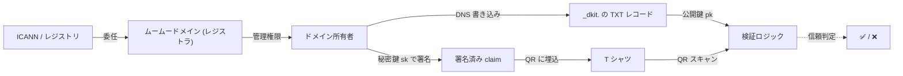
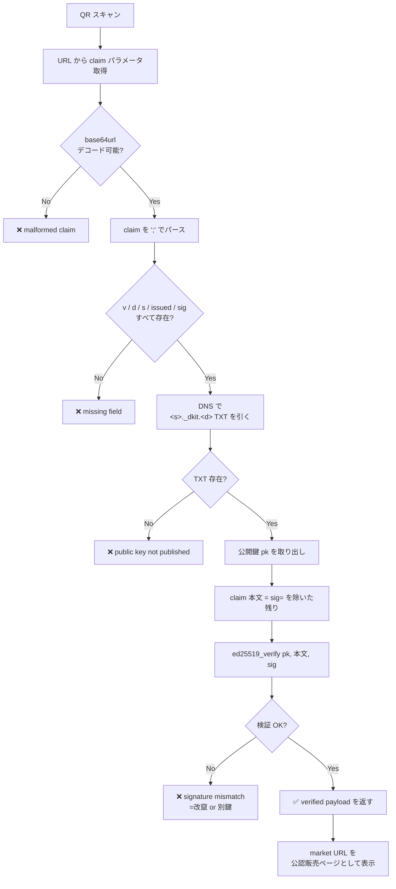

# DKIT — DomainKeys Identified T-shirt

> DKIM の T シャツ版。**ドメイン所有 = 真贋の根拠** にして、第三者が QR コード一つで「この T シャツの販売ページは正規である」を検証できるようにする仕組み。

## 動機

1. **「ドメインを持っている」=「ICANN/レジストリ階層で証明された存在」**。最も普及していて、最も改竄しづらいアイデンティティ。
2. **DNS は公開・改竄困難な掲示板**。ドメイン管理者しか書けない場所に署名鍵を置けば、その鍵による署名は信頼の連鎖を形成できる。
3. SSL/TLS の DV、DKIM、BIMI、SSHFP、OPENPGPKEY... と同じ系譜。**DKIT は DKIM の "T-shirt 版"**。

## 何を保証して、何を保証しないか

| | DKIT は保証する | DKIT は保証しない |
| --- | --- | --- |
| **ドメイン所有** | ✅ DNS に公開鍵を置ける = そのドメインを管理している | — |
| **販売ページの正当性** | ✅ 正規販売 URL を `market=` で公証 → 偽物が別 URL なら検出 | — |
| **デザインの著作権** | — | ❌ SVG が公開されている以上、誰でも同じ画像を流用できる |
| **物理的なTシャツの個体識別** | — | ❌ NFC や物理刻印など別レイヤが必要 |
| **リアル世界の個人特定** | — | ❌ ドメイン所有者が誰かは別問題 (Whois 代理など) |

設計上 `sha256` (SVG ハッシュ) や `design` (デザイン URL) は **意図的に外している**。これらをクレームに入れると「デザインそのものが偽造不可」という誤った安心感を与えてしまうため。

## 全体フロー

```mermaid
sequenceDiagram
  autonumber
  actor Owner as ドメイン所有者
  participant App as muumuu アプリ
  participant DNS as DNS<br/>(_dkit.<fqdn>)
  participant TShirt as Tシャツ (QR)
  actor Verifier as 検証する第三者

  Note over Owner,App: 初期セットアップ (1回だけ)
  Owner->>App: dkit:keygen 実行
  App-->>Owner: privateKey + publicKey (base64url, ed25519)
  Owner->>App: .env に DKIT_PRIVATE_KEY を保管
  Owner->>App: 「公開鍵 TXT を発行」ボタン
  App->>DNS: TXT default._dkit.example.com<br/>= "v=DKIT1; alg=ed25519; pk=<base64url>"

  Note over Owner,TShirt: T シャツデザインごと
  Owner->>App: 「この販売ページを公証」(market URL を入力)
  App->>App: claim = "v=DKIT1; d=...; s=default; issued=...; market=..."
  App->>App: sig = ed25519_sign(privateKey, claim)
  App-->>Owner: QR コード (URL: /verify?claim=<base64url>)
  Owner->>TShirt: QR を T シャツに印刷

  Note over Verifier,DNS: 任意のタイミングで検証
  Verifier->>TShirt: QR を読み取り
  TShirt-->>Verifier: https://app/verify?claim=<base64url>
  Verifier->>App: GET /verify?claim=...
  App->>DNS: dig TXT default._dkit.<claim の d>
  DNS-->>App: pk
  App->>App: ed25519_verify(pk, claim, sig)
  alt 検証成功
    App-->>Verifier: ✅ market URL を公認販売ページとして表示
  else 検証失敗
    App-->>Verifier: ❌ 検証エラー (海賊版の可能性)
  end
```

## クレーム形式

DKIM のヘッダフィールド形式を踏襲。`;` 区切り、`key=value` の連続。

```
v=DKIT1; d=<fqdn>; s=<selector>; issued=<date>; market=<url>; sig=<base64url>
```

| キー | 必須 | 意味 |
| --- | --- | --- |
| `v` | ✅ | プロトコルバージョン (現在 `DKIT1` 固定) |
| `d` | ✅ | ドメイン (`example.com`) |
| `s` | ✅ | セレクタ (`default`)。複数鍵運用 / ローテーション用 |
| `issued` | ✅ | 発行日 (`YYYY-MM-DD`、UTC 推奨) |
| `market` | 推奨 | 正規販売ページ URL |
| `sig` | ✅ | `sig=` を除いた残り全体への ed25519 署名 (base64url) |

**将来の拡張余地** (DKIM 同様、未知のキーは無視される):
- `serial=` 個体識別番号
- `exp=` 失効日
- `i=` 識別子 / サブドメイン

## DNS レコード

### 公開鍵 (1 ドメイン 1 セレクタにつき 1 回だけ発行)

```
default._dkit.example.com.  IN  TXT  "v=DKIT1; alg=ed25519; pk=<base64url-32byte-公開鍵>"
```

### セレクタとは

DKIM と同じく、鍵をローテーションするために `selector` を使う。最初は `default` だけだが、複数並行運用も可能:

```
default._dkit.example.com   TXT  "v=DKIT1; alg=ed25519; pk=<旧鍵>"
2026q3._dkit.example.com    TXT  "v=DKIT1; alg=ed25519; pk=<新鍵>"
```

クレームの `s=` で使ったセレクタが、検証時に参照する TXT を指す。

## 信頼の連鎖



ポイントは「**DNS に書ける** = **そのドメインの管理者**」が、DKIM / SPF / BIMI / ACME-DNS-01 と同じく信頼の根。DKIT 固有の追加暗号は ed25519 一つだけ。

## 検証フロー (詳細)



## セキュリティモデル

### 攻撃モデルと耐性

| 攻撃 | 耐性 | 理由 |
| --- | --- | --- |
| QR をコピーして偽 T シャツに貼る | ⚠️ デザイン真贋は守れない / market URL は同じものに飛ぶ | claim は QR 単位ではなく URL 単位の証明 |
| 別ドメインで claim を勝手に作る | ✅ 強い | そのドメインの公開鍵 TXT で検証失敗 |
| `market=` を書き換える | ✅ 強い | 署名対象が変わるので検証失敗 |
| ドメイン所有者の DNS を乗っ取る | ❌ 守れない | 信頼の根 (DNS) が崩れる |
| 秘密鍵を漏洩 | ❌ 守れない | 鍵ローテーションで対応 (旧 selector の TXT を削除) |
| HTTPS なしで `/verify` を提供 | ❌ MITM 可 | 必ず HTTPS で運用すること |

### 鍵管理

- 秘密鍵 (32byte raw seed) を base64url 化して `.env` に `DKIT_PRIVATE_KEY=...` で保管
- 公開鍵は秘密鍵から実行時に導出 ( `DkitSigner.derivePublicKey()` )
- 漏洩したら:
  1. 新しいセレクタで keypair を生成
  2. 新セレクタの TXT を公開
  3. 旧セレクタの TXT を **削除** (これで旧鍵による既存 claim はすべて失効)
  4. 必要なら新鍵で過去の claim を再発行

## 既知の制約

1. **DNS の TTL**: 公開鍵 TXT を更新しても、検証側のリゾルバキャッシュ次第で反映に数分〜数時間かかる。
2. **SVG 著作権は別問題**: クレームには SVG ハッシュを含めない設計だが、それは「クレームでは守れない」ということ。デザイン著作権保護は別レイヤ (透かし、契約、訴訟) で。
3. **個体識別なし**: 同じ販売ページから複数の T シャツが出荷される場合、QR は全部同じ。個別識別したいなら `serial=` を追加し、シリアル番号を物理的に刻印する必要がある。
4. **失効リスト未対応**: DKIT1 では `exp=` (失効日) や CRL に相当するものはない。鍵ローテーションで全失効するか、`exp` を追加するかは将来の拡張。

## 関連プロトコル

| プロトコル | DKIT との関係 |
| --- | --- |
| **DKIM** (RFC 6376) | メール署名版。ほぼ同じ構造 (TXT 公開鍵 + ヘッダ署名) |
| **BIMI** | ブランドロゴ表示。BIMI は DNS TXT で SVG URL を指定する点で似ているが、署名は VMC 証明書経由 |
| **SSHFP** (RFC 4255) | SSH ホスト鍵を DNS で公開。信頼の根が同じ |
| **OPENPGPKEY** (RFC 7929) | OpenPGP 鍵を DNS で公開 |
| **TLS-DV / ACME-DNS-01** | 「DNS に書ける = 所有者」のチャレンジレスポンス版 |

すべて「DNS への書き込み権限 = ドメイン所有」を信頼の根にする。DKIT もその系譜のひとつ。

## 参考

- DKIM: <https://datatracker.ietf.org/doc/html/rfc6376>
- BIMI: <https://bimigroup.org/>
- Ed25519: RFC 8032 <https://datatracker.ietf.org/doc/html/rfc8032>
